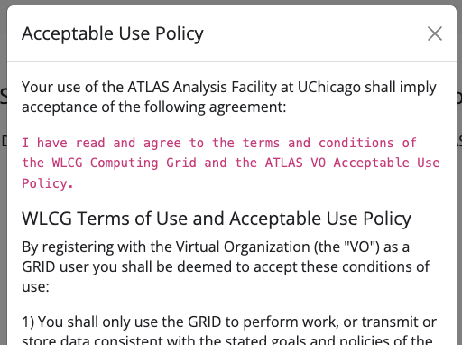
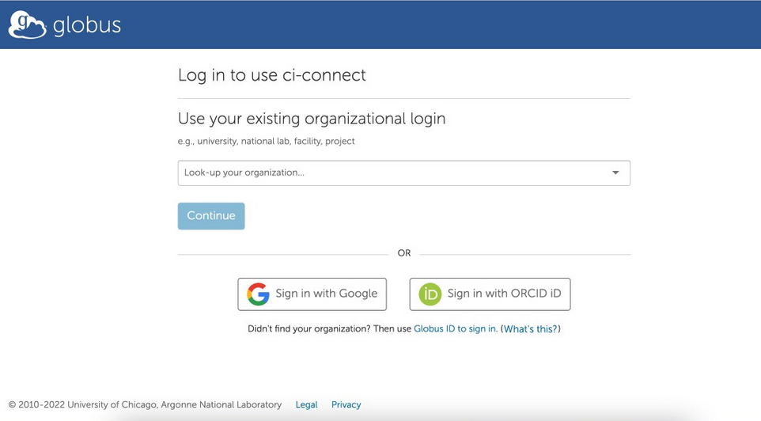
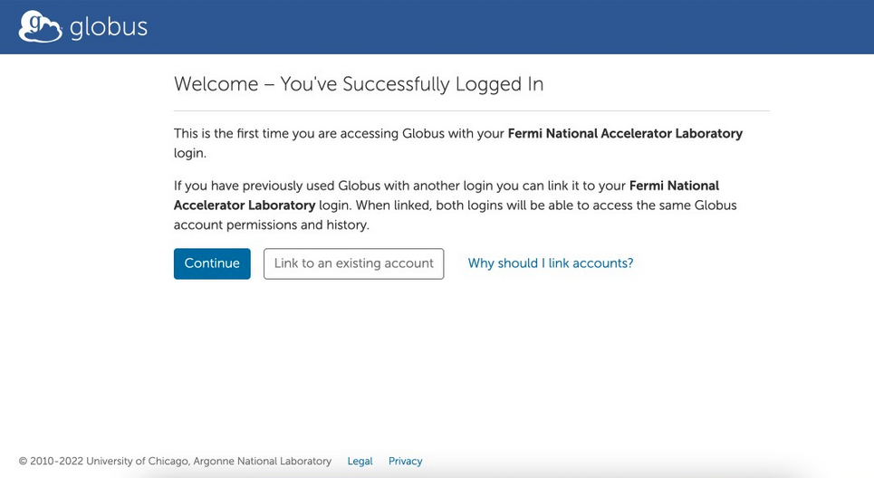
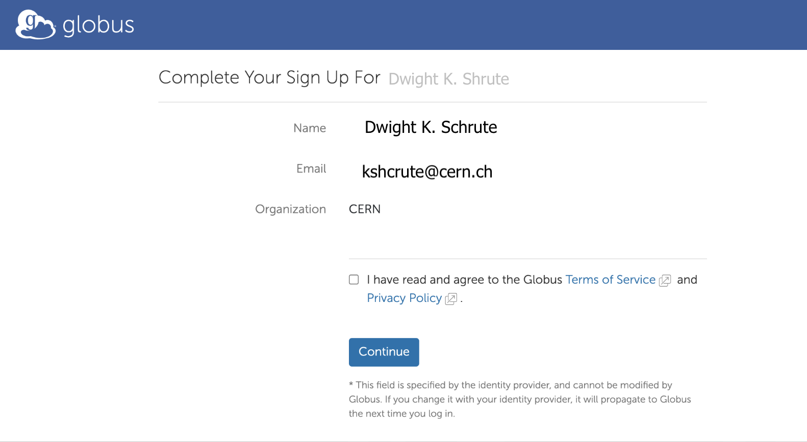
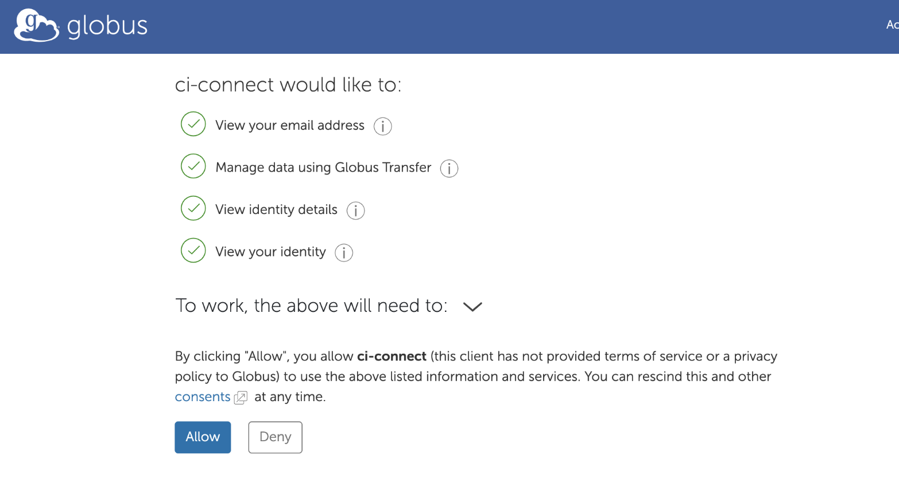
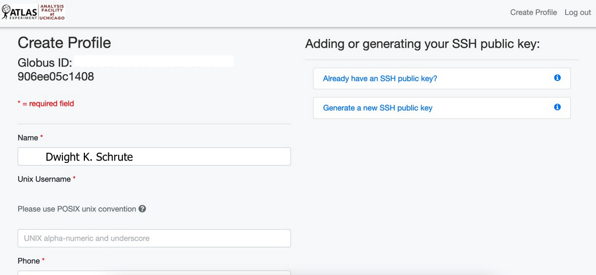
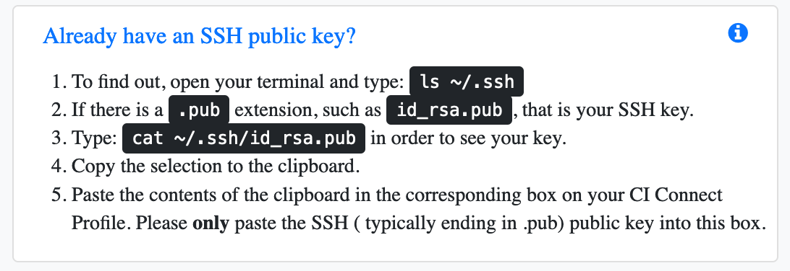
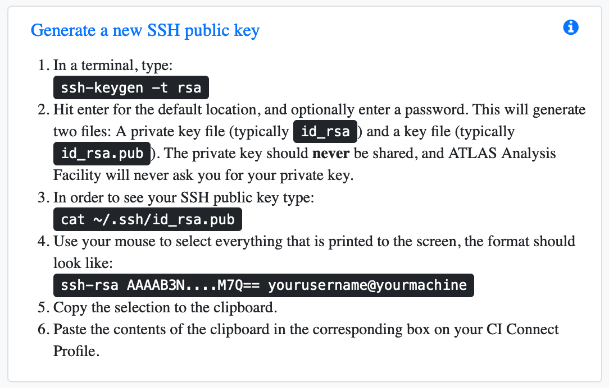
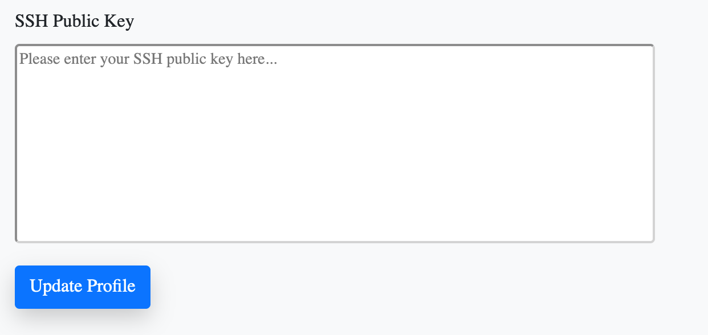
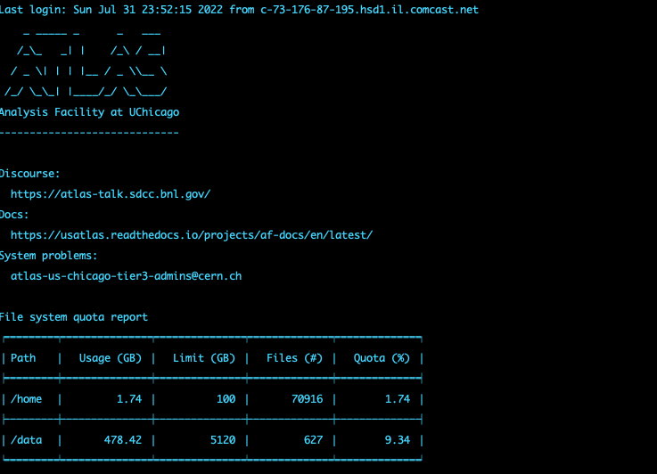

> ## Main steps
>
> - <a href="#account">Account request via CIConnect</a>
>
> - <a href="#key">Upload public SSH key</a>
>
> - <a href="#login">Login via SSH</a>
{: .callout}

<!------------------------------------------------------------------------------------->
<!------------------------------ Account request -------------------------------------->
<h2 id="account">Account Request via CIConnect</h2>


Go to <a href="https://af.uchicago.edu">UChicago Analysis Facility Website</a> and click <strong>Sign-Up</strong>

{:width="700"}{: .image-with-shadow }

Accept use policy and continue.

{: .image-with-shadow }

You will land on the Globus site: <strong>use your CERN or institutional account and login</strong>.

{:width="700"}{: .image-with-shadow }

After your organization is found, continue.

{:width="700"}{: .image-with-shadow }

Check details, agree to privacy policy and continue.

{:width="700"}{: .image-with-shadow }

Allow CI-Connect to acess info

{:width="700"}{: .image-with-shadow }

Good! Now you will create your profile.

{:width="700"}{: .image-with-shadow }


<!------------------------------------------------------------------------------------->
<!------------------------------ Upload public ssh key--------------------------------->

<h2 id="key">Upload public SSH key</h2>

To create your profile just type in the information required.

Now you will upload an SSH public key, **<font color="red">important: do not copy the contents of a file that does not end in `.pub`. You must only upload the `public`(.pub)</font>** part of the key.
if you are not sure if you have generated an SSH Public Key before, try the following instructions on your laptop command line.
{:width="700"}{: .image-with-shadow }

Follow the next steps if you don't have a public key or want to create an additional one for this analysis facility (<font color="Bright Gold">it is recommended to use a new SSH key for each instance</font>) for example by replacing "rsa" with "rsa_uc" in the following instructions
{:width="700"}{: .image-with-shadow }

Paste the contents of the clipboard on the next text box and update your profile! Remember to check you didn't add any blank space or additional characters
{:width="700"}{: .image-with-shadow }


<!------------------------------------------------------------------------------------->
<!------------------------------ login via ssh--------------------------------->
<h2 id="login">Login via SSH</h2>

Now that you signed up on the Analysis Facility website and uploaded a key, it will take a little bit of time to process your profile and add your account to the system. After 10-15 minutes, you ought to be able to login via SSH:

```bash
ssh <your_unix_username>@login.af.uchicago.edu
```
After logged in you should see something like the following images, containing a welcome message, links to information resources, and your file system quota report

{:width="500"}{: .image-with-shadow }

<strong><font color="red">If it does not work, please double check that you have been approved, have a public key uploaded and have waited at least 15 minutes. If you still have an issue, feel free to reach out to us for help.</font></strong>

<!----------------------------------- fin --------------------------------------------->


