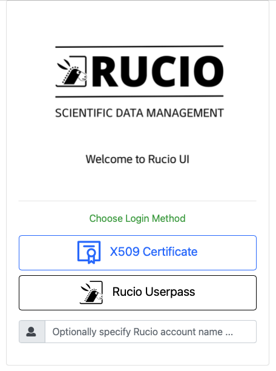

> ## Main steps
>
> - <a href="#atlasenv">Setup the ATLAS environment</a>
>
> - <a href="#certificate">Accessing ATLAS data: your 509 Proxy Certificate</a>
>
> - <a href="#login">Read data from Rucio </a>
{: .callout}

<!------------------------------------------------------------------------------------->
<!------------------------------ atlas environment -------------------------------------->

<h2 id="account"> Set up the ATLAS environment </h2>

Now that you logged into the analysis facility, to load ATLAS environment, add the following lines a shell script `myatlasenv.sh`. 

~~~bash
#!/bin/bash
export ATLAS_LOCAL_ROOT_BASE=/cvmfs/atlas.cern.ch/repo/ATLASLocalRootBase
export ALRB_localConfigDir=$HOME/localConfig
source $ATLAS_LOCAL_ROOT_BASE/user/atlasLocalSetup.sh
~~~
{: .language-bash}
{: .output}

Run the script to set up ATLAS environment and look at the image with the output.
~~~bash
 source myatlasenv.sh
 # at this point, you can lsetup root, rucio, athena, etc.
~~~

{:width="600"}{: .image-with-shadow }

Create a directory for the examples (optional)
~~~bash
 mkdir htcondor_module
~~~
For this tutorial we will work at the /home area but remember to move to the /data area when you use bigger data files.
- Small files (git repositories, source code, text files, configuration files, etc) —> $HOME
- Large files (input data, output, etc) —-> $DATA
 
## Accessing ATLAS data: your X509 proxy certificate

If you need to access ATLAS Data, you will need to copy your X509 certificate to the Analysis Facility (<a href="https://cafiles.cern.ch/cafiles/">https://cafiles.cern.ch/cafiles/</a>.). Store your certificate in $HOME/.globus and do:

* note: if the extension of your certificate is `.p12`, just replace `.pfx` with `.p12`

~~~bash
# on the command line:
mkdir ~/.globus #in case the directory doesn't exist.
cp mycertificate.pfx ~/.globus && cd ~/.globus
openssl pkcs12 -in <yourcertificate_name.pfx> -clcerts -nokeys -out usercert.pem 
# enter your import password:
# ...
openssl pkcs12 -in <yourcertificate_name.pfx> -nocerts -out userkey.pem
# enter your import password:
# ...
# enter your PEM pass phrase: 
# ...
chmod 400 userkey.pem
chmod 444 usercert.pem
cd - #go back to your home area /home/<user_name>
~~~~
{: .language-bash}

Now create an ATLAS VOMS proxy in the usual way:

~~~bash
# on the command line
lsetup emi
voms-proxy-init -voms atlas
# Enter GRID pass phrase for this identity:
# ...
voms-proxy-init -voms atlas -out $HOME/x509proxy
# Enter GRID pass phrase for this identity:
# ...
~~~~
{: .language-bash}

<!------------------------------------------------------------------------------------->
<!------------------------------ data from rucio --------------------------------->

<h2 id="rucio">Read data from Rucio</h2>

**NOTE:** Rucio documentation can be found <a href="https://rucio.cern.ch/documentation/">here</a>.

This is an example to read data from rucio, pretend to process it, and then push a small copied back to the $HOME filesystem. It assumes your X509 proxy certificate is valid and in your home directory.

Run the following lines from the command line, (be sure that you already call your file `myatlasenv.sh`, you only have to do this once per session)

~~~bash
lsetup rucio
rucio --verbose download data23_13p6TeV:data23_13p6TeV.00455975.physics_Main.merge.AOD.f1367_m2185._lb0820._0001.1
cd data23_13p6TeV
truncate --size 10MB data23_13p6TeV.00455975.physics_Main.merge.AOD.f1367_m2185._lb0820._0001.1
cp data23_13p6TeV.00455975.physics_Main.merge.AOD.f1367_m2185._lb0820._0001.1 $HOME/myjob.output
~~~~

{: .language-bash}

<!------------------------------------------------------------------------------------->
<!------------------------------ data to localgroupdisks --------------------------------->

<h2 id="rucio">Transfer data to local group disks (Rucio R2D2)</h2>

If you need to transfer data/MC from the grid to a local group disk, you can use the Rucio web interface for the data transfer (R2D2). Here the link: <a href="https://rucio-ui.cern.ch/r2d2/request">https://rucio-ui.cern.ch/r2d2/request</a>. You will need to use your 509 Proxy Certificate.

{:width="400"}{: .image-with-shadow }

Once you reach the main page, you can follow the "tour" that will guide you through the steps to transfer your data to any LOCALGROUPDISK.

{:width="1600"}{: .image-with-shadow }

<h2 id="xcache">XCache</h2>

Analysis Facility maintains an XCache server (managed through SLATE), with 25 x 1.5 TB NVMes and 2x25 Gbps NIC. ServiceX uses the XCache by default. Users can manually add the prefix "root://192.170.240.18:1094//" to their root paths, eg:

If the original path is:

~~~bash
root://fax.mwt2.org:1094//pnfs/uchicago.edu/atlaslocalgroupdisk/rucio/user/mgeyik/63/c4/user.mgeyik.26617246._000006.out.root
~~~~

make it:

~~~bash
root://192.170.240.18:1094//root://fax.mwt2.org:1094//pnfs/uchicago.edu/atlaslocalgroupdisk/rucio/user/mgeyik/63/c4/user.mgeyik.26617246._000006.out.root
~~~~

Alternatively you may use script xcache_ls to get the cfile containing the best paths to access all the files in their dataset.

<!------------------------------------------------------------------------------------->
<!------------------------------  --------------------------------->

<!----------------------------------- fin --------------------------------------------->


