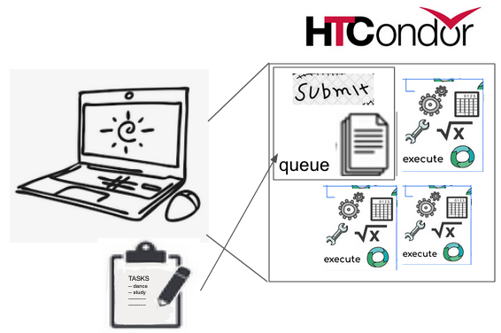
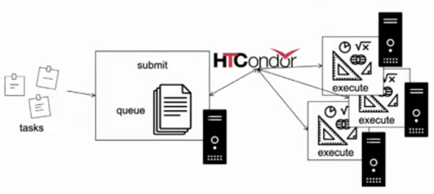
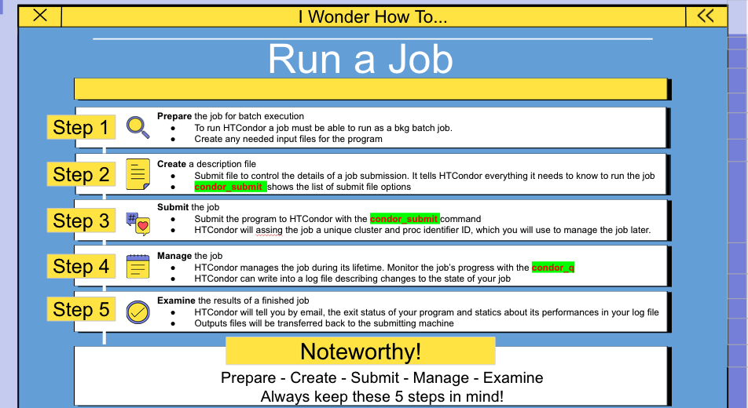

<!--- just a comment --->
> ## HTCondor
>
> - <a href="#intro">Introduction</a>
>
> - <a href="#running">Running a job</a>
>
> - <a href="#submitting">Submitting a job</a>
>
> - <a href="#managing">Managing a job</a>
>
> - <a href="#services">Services for running jobs</a>
>
{: .callout}
<!-------------------------------------------------------------------------------------->
<!----------------------------- about htcondor (introduction)--------------------------->

<h2 id="intro">Introduction</h2>

HTCondor is a specialized batch system for managing compute-intensive jobs. It provides a queuing mechanism, scheduling policy, priority scheme, and resource classifications. Users submit their compute jobs to HTCondor, HTCondor puts the jobs in a queue, runs them, and then informs the user as to the result.

This architecture can be implemented in different ways.

{: .image-with-shadow } | {: .image-with-shadow }


<!------------------------------------------------------------------------------------->
<!----------------------------- running a job ----------------------------------------->
<h2 id="running">Running a job</h2>

>
> - Job : an independently-scheduled unit of computing work
>
> - Executable: script to run.
>
> - Input:  input arguments and/or file based information.
>
> - Output: any files or display information produced by the executable.
>
{: .callout}
  
 
Work Decomposition

{: .image-with-shadow }


<!------------------------------------------------------------------------------------->
<!----------------------------- submitting a job -------------------------------------->


<h2 id="submitting"> Submitting a Job</h2>

The `condor_submit` command takes a job description file as input and submits the job to HTCondor.  Items such as the name of the executable to run, the initial working directory, and command-line arguments to the program all go into the submit description file. `condor_submit` creates a job ClassAd based upon the information, and HTCondor works toward running the job.

### Example 1: Basic Submission

This example is one of the simplest submit description files possible. It queues the program myexe for execution somewhere in the pool. As this submit description file does not request a specific operating system to run on, HTCondor will use the default, which is to run the job on a machine which has the same architecture and operating system it was submitted from.

Before submitting a job to HTCondor, it is a good idea to test it first locally, by running it from a command shell. This example job might look like this when run from the shell prompt.

Create a file called ```myexe``` with the following:
```bash
echo "Hello World"
```

and make it executable with ```chmod +x myexe``` and test with:

```bash
./myexe SomeArgument
```
The corresponding submit description file might look like the following

`example1.sub`
```bash
# Example 1
# Simple HTCondor submit description file
# Everything with a leading # is a comment

executable   = myexe
arguments    = SomeArgument

output       = outputfile   
error        = errorfile
log          = myexe.log

request_cpus   = 1
request_memory = 1024
request_disk   = 10240

should_transfer_files = yes

queue
```

> - Explanation of variables in example 1:
>
> output        :   The standard output for this job will go to the file `outputfile`.
>
> error :  The standard error output will go to `errorfile`.
>
> log :    Appended evenst about the job to the log file named `myexe.log`.
>
> request_cpus  :   The job should be allocated 1 cpu core.
>
> request_memory:   1024 megabytes of memory.
>
> request_disk  :   10240 kilobytes of scratch disk space.
>
> queue         :   Hey HTCondor! I've finished the description of the job, send it to the queue.
>
{: .callout}

### Example 2: Pre-Defined Macros

A simple example to show off some additional features and using pre-defined macros. Make a file called ```input_file``` with whatever you like and create the following submission script:

`example2.sub`
```bash

executable     = myexe
arguments      = input_file.$(Process)

request_memory = 4096
request_cpus   = 1
request_disk   = 16383

error   = err.$(Process)
output  = out.$(Process)
log     = myexe.log

should_transfer_files = yes
transfer_input_files = input_file.$(Process)

# submit 150 instances of this job
queue 150
```

Each instance of this program works on one input file. 
We prepare 150 copies of this input file in the current directoy, and name them input_file.0, ... up to input_file.149. 
Whit transfer_input_files, we tell HTCondor which input file to send to each instance of the program.

### Example 3: Integrating Python Scripts

We can also include python scripts to our job.

We write our executable in the file:

`hello.py`
```bash
#!/usr/bin/env python
import sys
import time
i=1
while i<=6:
        print(i)
        i+=1
        time.sleep(1)
print(2**8)
print("hello world received argument = " +sys.argv[1])
```

```bash
python hello.py atlas
```
Create the directory:

```bash
mkdir output
```

Now we need or submit file:

hello.sub
```bash
Universe        = vanilla
Executable      = hello.py
Output          = output/hello.out.$(Cluster).$(Process).txt
Error           = output/hello.error.$(Cluster).$(Process).txt
Log             = output/hello.log.$(Cluster).$(Process).txt
notification = Never
Arguments = $(Process)
PeriodicRelease = ((JobStatus==5) && (CurentTime - EnteredCurrentStatus) > 30)
OnExitRemove = (ExitStatus == 0)
Queue 4
```

submit out job

```bash
condor_submit hello.sub
```

check status:

```bash
condor_q
```

### Example 4: Base Example with C Program

A simple example with a small program in C.

Let's start creating a directory for this example 

```bash
mkdir simple_c
cd simple_c
```

Write your executable in the file:

`simple.c`
```bash
#include <stdio.h>

main(int argc, char **argv)
{
    int sleep_time;
    int input;
    int failure;

    if (argc != 3) {
        printf("Usage: simple <sleep-time> <integer>\n");
        failure = 1;
    } else {
        sleep_time = atoi(argv[1]);
        input      = atoi(argv[2]);

        printf("Thinking really hard for %d seconds...\n", sleep_time);
        sleep(sleep_time);
        printf("We calculated: %d\n", input * 2);
        failure = 0;
    }
    return failure;
}
```

compile the program

```bash
gcc -o simple simple.c
```

Now run the program and tell it to sleep for four seconds and calculate 10 * 2: 
```bash
./simple 4 10
```
output
```
Thinking really hard for 4 seconds...
We calculated: 20
```
{: .output}

Submitting the job

`simple.sub`

```bash
Universe   = vanilla
Executable = simple
Arguments  = 4 10
Log        = simple.log
Output     = simple.out
Error      = simple.error
Queue
```
Ask HTCondor to run the job

```bash
condor_submit simple.sub
```
Output
```
Submitting job(s)con.
Logging submit event(s).
1 job(s) submitted to cluster 6075
```
{: .output}

watch the job run

```
condor_q

-- Submitter: ws-03.gs.unina.it : <192.167.2.23:34353> : ws-03.gs.unina.it
 ID      OWNER            SUBMITTED     RUN_TIME ST PRI SIZE CMD               
   2.0   temp-01         3/15 16:27   0+00:00:00 I  0   0.0  simple 4 10       

1 jobs; 1 idle, 0 running, 0 held

% condor_q

-- Submitter: ws-03.gs.unina.it : <192.167.2.23:34353> : ws-03.gs.unina.it
 ID      OWNER            SUBMITTED     RUN_TIME ST PRI SIZE CMD               
   2.0   temp-01         3/15 16:27   0+00:00:01 R  0   0.0  simple 4 10       

1 jobs; 0 idle, 1 running, 0 held

% condor_q


-- Submitter: ws-03.gs.unina.it : <192.167.2.23:34353> : ws-03.gs.unina.it
 ID      OWNER            SUBMITTED     RUN_TIME ST PRI SIZE CMD               

0 jobs; 0 idle, 0 running, 0 held
```
{: .output}

#### Adding Parameters

If we would like to have our program calculate a whole set of values for different inputs. How can we do that?

`simple_set.sub`
```bash
Universe   = vanilla
Executable = simple
Arguments  = 4 10
Log        = simple_set.log
Output     = simple_set.$(Process).out
Error      = simple_set.$(Process).error
Queue

Arguments = 4 11
Queue

Arguments = 4 12
Queue
```

Now see what happens when we ask HTCondor to run the job and check the status

```
%  condor_submit submit
Submitting job(s)...
Logging submit event(s)...
3 job(s) submitted to cluster 2.

% condor_q 

-- Submitter: roy@ws-03.gs.unina.it : <192.167.2.23:32787> : ws-03.gs.unina.it
 ID      OWNER            SUBMITTED     RUN_TIME ST PRI SIZE CMD               
   2.0   roy             1/25 12:28   0+00:00:00 R  0   0.0  simple 4 10       
   2.1   roy             1/25 12:28   0+00:00:00 R  0   0.0  simple 4 11       
   2.2   roy             1/25 12:28   0+00:00:00 R  0   0.0  simple 4 12       

3 jobs; 0 idle, 3 running, 0 held

% condor_q 


-- Submitter: roy@ws-03.gs.unina.it : <128.105.48.160:32787> : ws-03.gs.unina.it
 ID      OWNER            SUBMITTED     RUN_TIME ST PRI SIZE CMD               

0 jobs; 0 idle, 0 running, 0 held

% ls simple*out
simple.0.out  simple.1.out  simple.2.out  simple.out

% cat simple.0.out
Thinking really hard for 4 seconds...
We calculated: 20

% cat simple.1.out
Thinking really hard for 4 seconds...
We calculated: 22

% cat simple.2.out
Thinking really hard for 4 seconds...
We calculated: 24
```
{: .output}

<!---
#### Submitting many similar jobs with one queue command

A wide variety of job submissions can be specified with extra information to the queue submit command. This flexibility eliminates the need for a job wrapper or Perl script for many submissions.

The form of the queue command defines variables and expands values, identifying a set of jobs. Square brackets identify an optional item.

queue [ < int expr > ]

queue [ < int expr > ] [ < varname > ] in [ slice ] < list of items > 

queue [ < int expr > ] [ < varname > ] matching [ files  l  dirs ] [ slice ] < list of items with file globbing > 

queue [ < int expr > ] [ < list of varnames > ] from [ slice ] < file name >  l  < list of items > 

All optional items have defaults:


- If < int expr > is not specified, it defaults to the value 1.

- If < varname > or < list of varnames > is not specified, it defaults to the single variable called ITEM.

- If slice is not specified, it defaults to all elements within the list. This is the Python slice [::], with a step value of 1.

- If neither files nor dirs is specified in a specification using the from key word, then both files and directories are considered when globbing.


The optional slice specifies a subset of the list of items using the Python syntax for a slice. Negative step values are not permitted.

Here are a set of examples.

> ## Example 1
>
> ~~~ bash
>transfer_input_files = $(filename)
>arguments            = -infile $(filename)
>queue filename matching files *.dat
> ~~~
>
> ~~~ bash
>transfer_input_files = initial.dat
>arguments            = -infile initial.dat
>queue
>transfer_input_files = middle.dat
>arguments            = -infile middle.dat
>queue
>transfer_input_files = ending.dat
>arguments            = -infile ending.dat
>queue
> ~~~
>
> {: .output}
{: .solution}


> ## Example 2
>
> ~~~ bash 
>queue 1 input in A, B, C
> ~~~
>
> ~~~ bash
>input = A
>queue
>input = B
>queue
>input = C
>queue
> ~~~
>
> {: .output}
{: .solution}

> ## Example 3
>
> ~~~ bash
>queue input, arguments from (
>  file1, -a -b 26
>  file2, -c -d 92
>)
> ~~~
> Each of the two variables specified is given a value from the list of items. For this example the queue command expands to:
>
> ~~~ bash
>input = file1
>arguments = -a -b 26
>queue
>input = file2
>arguments = -c -d 92
>queue
> ~~~
>
> {: .output}
{: .solution}

> ## Example 4
>
> ~~~ bash
>queue from seq 7 9 |
> ~~~
>
>feeds the list of items to queue with the output of seq 7 9:
>
> ~~~ bash
>item = 7
>queue
>item = 8
>queue
>item = 9
>queue
> ~~~
>
> {: .output}
{: .solution}

> ## Variables in the Submit Description File
>
>
>`$(Cluster) or $(ClusterId)`
>
>`$(Process) or $(ProcId)`
>
>`$$(a_machine_classad_attribute)`
>
>`$$([ an_evaluated_classad_expression ])`
>   
>`$(ARCH)`
>
>`$(OPSYS) $(OPSYSVER) $(OPSYSANDVER) $(OPSYSMAJORVER)`
>
>`$(SUBMIT_FILE)`
>
>`$(SUBMIT_TIME)`
>
>`$(Year) $(Month) $(Day)`
>
>`$(Item)`
>
>`$(ItemIndex)`
>
>`$(Step)`
>
>`$(Row)`
> {: .output}
{: .callout}

### Including Submit Commands Defined Elsewhere

Externally defined submit commands can be incorporated into the submit description file using the syntax

```bash
include : <what-to-include>
```

The <what-to-include> specification may specify a single file, where the contents of the file will be incorporated into the submit description file at the point within the file where the include is. Or, <what-to-include> may cause a program to be executed, where the output of the program is incorporated into the submit description file. The specification of <what-to-include> has the bar character (|) following the name of the program to be executed.

Consider the example

```bash
include : ./list-infiles.sh |
```

```bash
#!/bin/sh

echo "transfer_input_files = `ls -m infiles/*.dat`"
exit 0
```


```bash
transfer_input_files = infiles/A.dat, infiles/B.dat, infiles/C.dat
```

is incorporated into the submit description file.

### Using Conditionals in the Submit Description File

Conditional if/else semantics are available in a limited form. The syntax:

```bash
if <simple condition>
   <statement>
   . . .
   <statement>
else
   <statement>
   . . .
   <statement>
endif
```

An else key word and statements are not required, such that simple if semantics are implemented. The <simple condition> does not permit compound conditions. It optionally contains the exclamation point character (!) to represent the not operation, followed by

```bash
    if defined MY_UNDEFINED_VARIABLE
       X = 12
    else
       X = -1
    endif
```

results in X = -1, when MY_UNDEFINED_VARIABLE is not yet defined.

- the version keyword, representing the version number of of the daemon or tool currently reading this conditional. This keyword is followed by an HTCondor version number. That version number can be of the form x.y.z or x.y. The version of the daemon or tool is compared to the specified version number. The comparison operators are

    - `==` for equality. Current version 8.2.3 is equal to 8.2.

    - `>=` to see if the current version number is greater than or equal to. Current version 8.2.3 is greater than 8.2.2, and current version 8.2.3 is greater than or equal to 8.2.

    - `<=  to see if the current version number is less than or equal to. Current version 8.2.0 is less than 8.2.2, and current version 8.2.3 is less than or equal to 8.2.

    As an example,

    ```bash
    if version >= 8.1.6
       DO_X = True
    else
       DO_Y = True
    endif
    ```

    - True or yes or the value 1. The statement(s) are incorporated.

    - False or no or the value 0 The statement(s) are not incorporated.

This syntax

```bash
if <simple condition>
   <statement>
   . . .
   <statement>
elif <simple condition>
   <statement>
   . . .
   <statement>
endif
```

is the same as syntax

```bash
if <simple condition>
   <statement>
   . . .
   <statement>
else
   if <simple condition>
      <statement>
      . . .
      <statement>
   endif
endif
```

Example

```bash
if defined X
  arguments = -n $(X)
else
  arguments = -n 1 -debug
endif
```

Submit variable X is defined on the condor_submit command line with
```bash
condor_submit  X=3  sample.sub
```

This command line incorporates the submit command X = 3 into the submission before parsing the submit description file. For this submission, the command line arguments of the submitted job become

```bash
arguments = -n 3
```

If the job were instead submitted with the command line

```bash
condor_submit  sample.sub
```

then the command line arguments of the submitted job become

```bash
arguments = -n 1 -debug
```
        
- Interactive Jobs

An interactive job is a Condor job that is provisioned and scheduled like any other vanilla universe Condor job onto an execute machine within the pool. The result of a running interactive job is a shell prompt issued on the execute machine where the job runs. 

Neither the submit nor the execute host for interactive jobs may be on Windows platforms.

The current working directory of the shell will be the initial working directory of the running job. The shell type will be the default for the user that submits the job. At the shell prompt, X11 forwarding is enabled.

Each interactive job will have a job ClassAd attribute of
```bash
InteractiveJob = True
```

Submission of an interactive job specifies the option -interactive on the condor_submit command line.

A submit description file may be specified for this interactive job. Within this submit description file, a specification of these 5 commands will be either ignored or altered:

1. executable

2. transfer_executable

3. arguments

4. universe . The interactive job is a vanilla universe job.

5. queue <n>. In this case the value of <n> is ignored; exactly one interactive job is queued.

The submit description file may specify anything else needed for the interactive job, such as files to transfer.

If no submit description file is specified for the job, a default one is utilized as identified by the value of the configuration variable INTERACTIVE_SUBMIT_FILE .

Here are examples of situations where interactive jobs may be of benefit.

- An application that cannot be batch processed might be run as an interactive job. Where input or output cannot be captured in a file and the executable may not be modified, the interactive nature of the job may still be run on a pool machine, and within the purview of Condor.

- A pool machine with specialized hardware that requires interactive handling can be scheduled with an interactive job that utilizes the hardware.

- The debugging and set up of complex jobs or environments may benefit from an interactive session. This interactive session provides the opportunity to run scripts or applications, and as errors are identified, they can be corrected on the spot.

- Development may have an interactive nature, and proceed more quickly when done on a pool machine. It may also be that the development platforms required reside within Condor’s purview as execute hosts.

- Submitting Lots of Jobs

When submitting a lot of jobs with a single submit file, you can dramatically speed up submission and reduce the load on the condor_schedd by submitting the jobs as a late materialization job factory.

A submission of this form sends a single ClassAd, called the Cluster ad, to the condor_schedd, as well as instructions to create the individual jobs as variations on that Cluster ad. These instructions are sent as a submit digest and optional itemdata. The submit digest is the submit file stripped down to just the statements that vary between jobs. The itemdata is the arguments to the Queue statement when the arguments are more than just a count of jobs.

The condor_schedd will use the submit digest and the itemdata to create the individual job ClassAds when they are needed. Materialization is controlled by two values stored in the Cluster classad, and by optional limits configured in the condor_schedd.

The max_idle limit specifies the maximum number of non-running jobs that should be materialized in the condor_schedd at any one time. One or more jobs will materialize whenever a job enters the Run state and the number of non-running jobs that are still in the condor_schedd is less than this limit. This limit is stored in the Cluster ad in the JobMaterializeMaxIdle attribute.

The max_materialize limit specifies an overall limit on the number of jobs that can be materialized in the condor_schedd at any one time. One or more jobs will materialize when a job leaves the condor_schedd and the number of materialized jobs remaining is less than this limit. This limit is stored in the Cluster ad in the JobMaterializeLimit attribute.

Late materialization can be used as a way for a user to submit millions of jobs without hitting the MAX_JOBS_PER_OWNER or MAX_JOBS_PER_SUBMISSION limits in the condor_schedd, since the condor_schedd will enforce these limits by applying them to the max_materialize and max_idle values specified in the Cluster ad.

To give an example, the following submit file:
```bash
executable     = foo
arguments      = input_file.$(Process)

request_memory = 4096
request_cpus   = 1
request_disk   = 16383

error   = err.$(Process)
output  = out.$(Process)
log     = foo.log

should_transfer_files = yes
transfer_input_files = input_file.$(Process)

# submit as a factory with an idle jobs limit
max_idle = 100

# submit 15,000 instances of this job
queue 15*1000
```

When submitted as a late materialization factory, the submit digest for this factory will contain only the submit statments that vary between jobs, and the collapsed queue statement like this:

```bash
arguments = input_file.$(Process)
error = err.$(Process)
output = out.$(Process)
transfer_input_files = input_file.$(Process)

queue 15000
```


{: .source}

{: .solution}

-->

<!------------------------------------------------------------------------------------->
<!----------------------------- managing a job ---------------------------------------->

<h2 id="managing">Managing a job</h2>

What to do once jobs are submitted?

### Checking on the progress of jobs

You can check on your jobs with the condor_q command.

condor_q

~~~
-- Schedd: submit.chtc.wisc.edu : <127.0.0.1:9618?... @ 12/31/69 23:00:00
OWNER    BATCH_NAME    SUBMITTED   DONE   RUN    IDLE   HOLD  TOTAL JOB_IDS
nemo     batch23       4/22 20:44      _      _      _      1      _ 3671850.0
nemo     batch24       4/22 20:56      _      _      _      1      _ 3673477.0
nemo     batch25       4/22 20:57      _      _      _      1      _ 3673728.0
nemo     batch26       4/23 10:44      _      _      _      1      _ 3750339.0
nemo     batch27       7/2  15:11      _      _      _      _      _ 7594591.0
nemo     batch28       7/10 03:22   4428      3      _      _   4434 7801943.0 ... 7858552.0
nemo     batch29       7/14 14:18   5074   1182     30     19  80064 7859129.0 ... 7885217.0
nemo     batch30       7/14 14:18   5172   1088     28     30  58310 7859106.0 ... 7885192.0

2388 jobs; 0 completed, 1 removed, 58 idle, 2276 running, 53 held, 0 suspended
~~~
{: .output}

Often, when you are starting out, and have few jobs, you may want to see one line of output per job. The -nobatch option to condor_q does this, and output might look something like:

condor_q -nobatch

~~~
-- Schedd submit.chtc.wisc.edu : <127.0.0.1:9618?...
ID          OWNER        SUBMITTED     RUN_TIME ST PRI SIZE CMD
1297254.0   nemo         5/31 18:05  14+17:40:01 R  0   7.3  condor_dagman
1297255.0   nemo         5/31 18:05  14+17:39:55 R  0   7.3  condor_dagman
1297256.0   nemo         5/31 18:05  14+17:39:55 R  0   7.3  condor_dagman
1297259.0   nemo         5/31 18:05  14+17:39:55 R  0   7.3  condor_dagman
1297261.0   nemo         5/31 18:05  14+17:39:55 R  0   7.3  condor_dagman
1302278.0   nemo         6/4  12:22   1+00:05:37 I  0   390.6 mdrun_1.sh
1304740.0   nemo         6/5  00:14   1+00:03:43 I  0   390.6 mdrun_1.sh
1304967.0   nemo         6/5  05:08   0+00:00:00 I  0   0.0  mdrun_1.sh

14 jobs; 4 idle, 8 running, 2 held
~~~
{: .output}

The output contains many columns of information about the queued jobs. The ST column (for status) shows the status of current jobs in the queue:

- R: The job is currently running.
- I: The job is idle. It is not running right now, because it is waiting for a machine to become available.
- H: The job is the hold state. In the hold state, the job will not be scheduled to run until it is released. See the condor_hold and the condor_release manual pages.

Another useful method of tracking the progress of jobs is through the job event log.

When a job begins to run, HTCondor starts up a condor_shadow process on the submit machine. 

You can also find all the machines that are running your job through the condor_status command. For example, to find all the machines that are running jobs submitted by breach@cs.wisc.edu, type:

~~~
condor_status -constraint 'RemoteUser == "breach@cs.wisc.edu"'

Name       Arch     OpSys        State      Activity   LoadAv Mem  ActvtyTime

alfred.cs. INTEL    LINUX        Claimed    Busy       0.980  64    0+07:10:02
biron.cs.w INTEL    LINUX        Claimed    Busy       1.000  128   0+01:10:00
cambridge. INTEL    LINUX        Claimed    Busy       0.988  64    0+00:15:00
falcons.cs INTEL    LINUX        Claimed    Busy       0.996  32    0+02:05:03
happy.cs.w INTEL    LINUX        Claimed    Busy       0.988  128   0+03:05:00
istat03.st INTEL    LINUX        Claimed    Busy       0.883  64    0+06:45:01
istat04.st INTEL    LINUX        Claimed    Busy       0.988  64    0+00:10:00
istat09.st INTEL    LINUX        Claimed    Busy       0.301  64    0+03:45:00
...
~~~
{: .output}
To find all the machines that are running any job at all, type:

~~~
condor_status -run

Name       Arch     OpSys        LoadAv RemoteUser           ClientMachine

adriana.cs INTEL    LINUX        0.980  hepcon@cs.wisc.edu   chevre.cs.wisc.
alfred.cs. INTEL    LINUX        0.980  breach@cs.wisc.edu   neufchatel.cs.w
amul.cs.wi X86_64   LINUX        1.000  nice-user.condor@cs. chevre.cs.wisc.
anfrom.cs. X86_64   LINUX        1.023  ashoks@jules.ncsa.ui jules.ncsa.uiuc
anthrax.cs INTEL    LINUX        0.285  hepcon@cs.wisc.edu   chevre.cs.wisc.
astro.cs.w INTEL    LINUX        1.000  nice-user.condor@cs. chevre.cs.wisc.
aura.cs.wi X86_64   WINDOWS      0.996  nice-user.condor@cs. chevre.cs.wisc.
balder.cs. INTEL    WINDOWS      1.000  nice-user.condor@cs. chevre.cs.wisc.
bamba.cs.w INTEL    LINUX        1.574  dmarino@cs.wisc.edu  riola.cs.wisc.e
bardolph.c INTEL    LINUX        1.000  nice-user.condor@cs. chevre.cs.wisc.
...
~~~
{: .output}

### Peeking in on a running job’s output files

The `condor_tail` command can copy output files from a running job on a remote machine back to the submit machine. condor_tail uses the same networking stack as HTCondor proper, so it will work if the execute machine is behind a firewall.

```bash
condor_tail -f xx.yy
```
To copy a different file, run

```bash
condor_tail xx.yy name_of_output_file
```

### Removing a job from a queue

`condor_rm`

```bash
condor_q -nobatch

-- Schedd: froth.cs.wisc.edu : <128.105.73.44:33847> : froth.cs.wisc.edu
 ID      OWNER            SUBMITTED    CPU_USAGE ST PRI SIZE CMD
 125.0   raman           4/11 14:37   0+00:00:00 R  0   1.4  sleepy
 132.0   raman           4/11 16:57   0+00:00:00 R  0   1.4  hello

2 jobs; 1 idle, 1 running, 0 held

condor_rm 132.0
Job 132.0 removed.

condor_q -nobatch

-- Schedd: froth.cs.wisc.edu : <128.105.73.44:33847> : froth.cs.wisc.edu
 ID      OWNER            SUBMITTED    CPU_USAGE ST PRI SIZE CMD
 125.0   raman           4/11 14:37   0+00:00:00 R  0   1.4  sleepy

1 jobs; 1 idle, 0 running, 0 held
```
{: .output}

### Placing a job on hold

`condor_hold`
`condor_release`

Jobs that are running when placed on hold will start over from the beginning when released.

### Changing the priority of jobs

HTCondor provides each user with the capability of assigning priorities to each submitted job.

```bash
condor_q -nobatch raman

-- Submitter: froth.cs.wisc.edu : <128.105.73.44:33847> : froth.cs.wisc.edu
 ID      OWNER            SUBMITTED    CPU_USAGE ST PRI SIZE CMD
 126.0   raman           4/11 15:06   0+00:00:00 I  0   0.3  hello

1 jobs; 1 idle, 0 running, 0 held

condor_prio -p -15 126.0

condor_q -nobatch raman

-- Submitter: froth.cs.wisc.edu : <128.105.73.44:33847> : froth.cs.wisc.edu
 ID      OWNER            SUBMITTED    CPU_USAGE ST PRI SIZE CMD
 126.0   raman           4/11 15:06   0+00:00:00 I  -15 0.3  hello

1 jobs; 1 idle, 0 running, 0 held
```

It is important to note that these job priorities are completely different from the user priorities assigned by HTCondor. 

## Job Not Running?

The most common reason why the job is not running is that HTCondor has not yet been through its periodic negotiation cycle, in which queued jobs are assigned to machines within the pool and begin their execution.

'-analyze` option of the condor_q command. Here is an example;

```bash
condor_q -analyze 27497829

-- Submitter: s1.chtc.wisc.edu : <128.104.100.43:9618?sock=5557_e660_3> : s1.chtc.wisc.edu
User priority for ei@chtc.wisc.edu is not available, attempting to analyze without it.
---
27497829.000:  Run analysis summary.  Of 5257 machines,
   5257 are rejected by your job's requirements
      0 reject your job because of their own requirements
      0 match and are already running your jobs
      0 match but are serving other users
      0 are available to run your job
        No successful match recorded.
        Last failed match: Tue Jun 18 14:36:25 2013

        Reason for last match failure: no match found

WARNING:  Be advised:
   No resources matched request's constraints

The Requirements expression for your job is:

    ( OpSys == "OSX" ) && ( TARGET.Arch == "X86_64" ) &&
    ( TARGET.Disk >= RequestDisk ) && ( TARGET.Memory >= RequestMemory ) &&
    ( ( TARGET.HasFileTransfer ) || ( TARGET.FileSystemDomain == MY.FileSystemDomain ) )


Suggestions:
    Condition                         Machines Matched Suggestion
    ---------                         ---------------- ----------
1   ( target.OpSys == "OSX" )         0                MODIFY TO "LINUX"
2   ( TARGET.Arch == "X86_64" )       5190
3   ( TARGET.Disk >= 1 )              5257
4   ( TARGET.Memory >= ifthenelse(MemoryUsage isnt undefined,MemoryUsage,1) )
                                      5257
5   ( ( TARGET.HasFileTransfer ) || ( TARGET.FileSystemDomain == "submit-1.chtc.wisc.edu" ) )
                                      5257
```
{: .output}

<!---
### Job in the Hold State

For the example job ID 16.0, use:

condor_q  -hold  16.0
-->

### Job Termination


A ticket of execution is usually issued by the condor_startd, and includes:

- when the condor_startd was told, or otherwise decided, to terminate the job (the when attribute);

- who made the decision to terminate, usually a Sinful string (the who attribute);

- and what method was employed to command the termination, as both as string and an integer (the How and HowCode attributes).

The relevant log events include a human-readable rendition of the ToE, and the job ad is updated with the ToE after the usual delay.

As of version 8.9.4, HTCondor only issues ToE in three cases:

- when the job terminates of its own accord (issued by the starter, HowCode 0);

- and when the startd terminates the job because it received a DEACTIVATE_CLAIM commmand (HowCode 1)

- or a DEACTIVATE_CLAIM_FORCIBLY command (HowCode 2).

- Job Completion

When an HTCondor job completes, either through normal means or by abnormal termination by signal, HTCondor will remove it from the job queue.

By default, HTCondor does not send an email message when the job completes. Modify this behavior with the notification command in the submit description file. The message will include the exit status of the job, which is the argument that the job passed to the exit system call when it completed, or it will be notification that the job was killed by a signal. Notification will also include the following statistics (as appropriate) about the job:

- **Submitted** at:

    when the job was submitted with condor_submit
- **Completed** at:

    when the job completed
- **Real Time:**

    the elapsed time between when the job was submitted and when it completed, given in a form of <days> <hours>:<minutes>:<seconds>
- **Virtual Image Size:**

    memory size of the job, computed when the job checkpoints


The job terminated event includes the following:

- the type of termination (normal or by signal)

- the return value (or signal number)

- local and remote usage for the last (most recent) run (in CPU-seconds)

- local and remote usage summed over all runs (in CPU-seconds)

- bytes sent and received by the job’s last (most recent) run,

- bytes sent and received summed over all runs,

- a report on which partitionable resources were used, if any. Resources include CPUs, disk, and memory; all are lifetime peak values.


- Summary of all HTCondor users and their jobs

When jobs are submitted, HTCondor will attempt to find resources to run the jobs. 

~~~
condor_status -submitters


Name                 Machine      Running IdleJobs HeldJobs

ballard@cs.wisc.edu  bluebird.c         0       11        0
nice-user.condor@cs. cardinal.c         6      504        0
wright@cs.wisc.edu   finch.cs.w         1        1        0
jbasney@cs.wisc.edu  perdita.cs         0        0        5

                           RunningJobs           IdleJobs           HeldJobs

 ballard@cs.wisc.edu                 0                 11                  0
 jbasney@cs.wisc.edu                 0                  0                  5
nice-user.condor@cs.                 6                504                  0
  wright@cs.wisc.edu                 1                  1                  0

               Total                 7                516                  5
~~~
{: .output }

<!---
- Automatically managing a job

   - Automatically rerunning a failed job

If a job exits with a non-zero exit code, this usually means that some error has happened. 

```bash
# Example submit description with max_retries

executable   = myexe
arguments    = SomeArgument

# Retry this job 5 times if non-zero exit code
max_retries = 5

output       = outputfile
error        = errorfile
log          = myexe.log

request_cpus   = 1
request_memory = 1024
request_disk   = 10240

should_transfer_files = yes

queue
```

   - Automatically removing a job in the queue

In the submit description file, set periodic_remove to a classad expression. For example, to automatically remove a job which has been in the queue for more than 100 hours, the submit file could have

```bash
periodic_remove = (time() - QDate) > (100 * 3600)
```

or, to remove jobs that have been running for more than two hours:
```bash
periodic_remove = (JobStatus == 2) && (time() - EnteredCurrentStatus) > (2 * 3600)
```

   - Automatically releasing a held job

In the same way that a job can be automatically held, jobs in the held state can be released with the periodic_release command. Often, using a periodic_hold with a paired periodic_release is a good way to restart a stuck job.

```bash
periodic_hold = (JobStatus == 2) && (time() - EnteredCurrentStatus) > (2 * 3600)
periodic_hold_reason = "Job ran for more than two hours"
periodic_hold_subcode = 42
periodic_release = (HoldReasonSubCode == 42)
```

   - Holding a completed job

A job may exit, and HTCondor consider it completed, even though something has gone wrong with the job. A held job informs users that there may have been a problem with the job that should be investigated. For example, if a job should never exit by a signal, the job can be put on hold if it does with

```bash
on_exit_hold = ExitBySignal == true
```
Go to <a href="https://htcondor.readthedocs.io/en/latest/man-pages/index.html">Command reference manual</a>

{: .challenge}
-->

<!-------------------------------------------------------------------------------------->
<!----------------------------- services for running jobs ------------------------------>

<h2 id="services"> Services for Running Jobs</h2>

In general, it is preferable to just declare the minimum set of needed environment variables with the environment command, as that clearly declares the needed environment variables. 

Commands within the submit description file may reference the environment variables of the submitter. Submit description file commands use $ENV(EnvironmentVariableName) to reference the value of an environment variable.

- Extra Environment Variables HTCondor sets for Jobs

Additional environment variables

- `_CONDOR_SCRATCH_DIR` names the directory where the job may place temporary data files. This directory is unique for every job that is run, and its contents are deleted by HTCondor when the job stops running on a machine. When file transfer is enabled, the job is started in this directory.

- `_CONDOR_SLOT` gives the name of the slot (for multicore machines), on which the job is run. On machines with only a single slot, the value of this variable will be 1, just like the SlotID attribute in the machine’s ClassAd. See the Policy Configuration for Execute Hosts and for Submit Hosts section for more details about configuring multicore machines.

- `_CONDOR_JOB_AD` is the path to a file in the job’s scratch directory which contains the job ad for the currently running job. The job ad is current as of the start of the job, but is not updated during the running of the job. The job may read attributes and their values out of this file as it runs, but any changes will not be acted on in any way by HTCondor. The format is the same as the output of the condor_q -l command. This environment variable may be particularly useful in a USER_JOB_WRAPPER.

- `_CONDOR_MACHINE_AD` is the path to a file in the job’s scratch directory which contains the machine ad for the slot the currently running job is using. The machine ad is current as of the start of the job, but is not updated during the running of the job. The format is the same as the output of the condor_status -l command. Interesting attributes jobs may want to look at from this file include Memory and Cpus, the amount of memory and cpus provisioned for this slot.

- `_CONDOR_JOB_IWD` is the path to the initial working directory the job was born with.

- `_CONDOR_WRAPPER_ERROR_FILE` is only set when the administrator has installed a USER_JOB_WRAPPER. If this file exists, HTCondor assumes that the job wrapper has failed and copies the contents of the file to the StarterLog for the administrator to debug the problem.

- `CUBACORES GOMAXPROCS JULIA_NUM_THREADS MKL_NUM_THREADS NUMEXPR_NUM_THREADS OMP_NUM_THREADS OMP_THREAD_LIMIT OPENBLAS_NUM_THREADS TF_LOOP_PARALLEL_ITERATIONS TF_NUM_THREADS` are set to the number of cpu cores provisioned to this job. Should be at least RequestCpus, but HTCondor may match a job to a bigger slot. Jobs should not spawn more than this number of cpu-bound threads, or their performance will suffer. Many third party libraries like OpenMP obey these environment variables.

- `X509_USER_PROXY` gives the full path to the X.509 user proxy file if one is associated with the job. Typically, a user will specify x509userproxy in the submit description file.


{: .challenge_ brown box} 

<!-------------------------------------------------------------------------------------->
<!-----------------------------  ------------------------------>

{: .callout}



