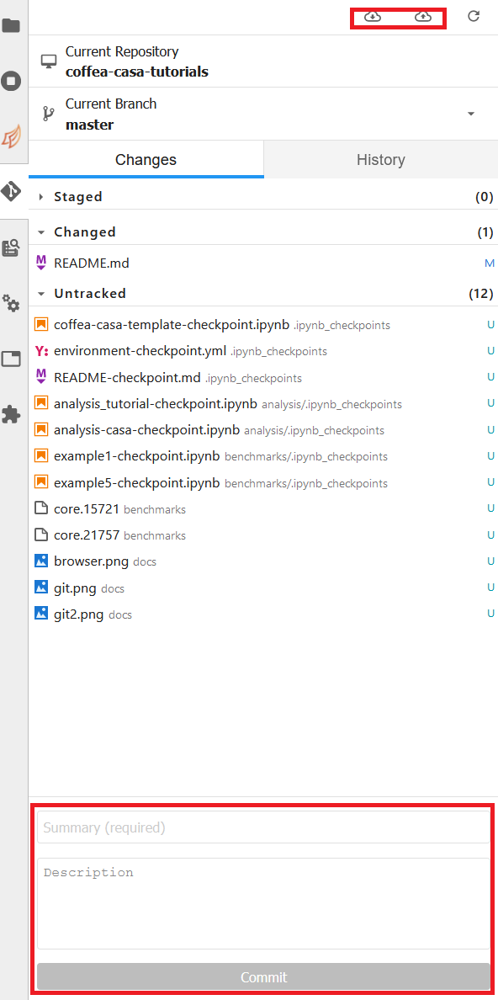
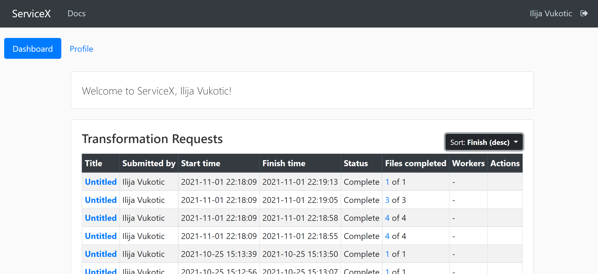

<!--
> ## About Coffea Casa
>
> - <a href="#prerequisites">Prerequisites</a>
>
> - <a href="#access">Access</a>
>
> - <a href="#authz">Atlas AuthZ authentication</a> 
>
> - <a href="#docker">Docker</a>
>
> - <a href="#cluster">Cluster resources</a>
>
> - <a href="#open">Open a new console or file</a>
>
> - <a href="#git">Using git</a>
>
{: .callout}-->

# About Coffea Casa

Coffea-Casa -  Is a Prototype of an Analysis Facility for **Columnar Object Framework For Effective Analysis (Coffea)**. Provides services for "low latency columnar analysis" based on <strong>Dask and Jupyter</strong>. It lowes time for analysis providing a **user-friendly computational environment that simplifies and accelerates the delivery of HEP results**.

>
> Deployed via Fluxcd
>
> Docker images served from OSG Harbor 
>
> User authentication via Indico IAM for Atlas
>
{: .callout}

{:width="700"}{: .image-with-shadow }

> ## Documentation sources 
> 
> - Documentation  <a href="https://coffea-casa.readthedocs.io/en/latest/#">coffea-casa readthedocs</a>
> 
> - Coffea <a href="https://coffeateam.github.io/coffea/">documentation</a>
>
> - Check this <a href="https://github.com/CoffeaTeam/coffea-casa-tutorials">tutorial on columnar analysis in coffea</a>
>
> - Are you familiar with Python, Jupyter Notebooks, JupyterLab interface?
    >
    > - <a href="https://docs.python.org/3/tutorial/"> python tutorial </a>
    >
    > - <a href="https://jupyter.org/"> jupyter notebook documentation </a>
    >
    > - <a href="https://jupyterlab.readthedocs.io/en/stable/user/interface.html"> JupyterLab interface<a> 
    >
>
{: .callout}

## Access 

<a href="https://coffea.af.uchicago.edu">access point to the Coffea-Casa Analysis Facility at UChicago</a>

{:width="700"}{: .image-with-shadow }

<h2 id="authz">Atlas AuthZ authentication</h2>

{:width="700"}{: .image-with-shadow }

{:width="700"}{: .image-with-shadow }

<h2 id="docker">Docker</h2>

{:width="700"}{: .image-with-shadow }
{:width="700"}{: .image-with-shadow }

<h2 id="cluster">Cluster resources</h2>

{:width="600"}{: .image-with-shadow }
{:width="600"}{: .image-with-shadow }

<h2 id="open">Open a new console or file</h2>

{:width="600"}{: .image-with-shadow }
{:width="700"}{: .image-with-shadow }

<h2 id="git">Using git</h2>

{:width="600"}{: .image-with-shadow } 
{:width="600"}{: .image-with-shadow } 
{:width="600"}{: .image-with-shadow }

# Coffea-Casa ServiceX

> ## About ServiceX
>
> - <a href="#servicex">ServiceX</a>
>
> - <a href="#columnar">Check this examples!! (please)</a>
>
{: .callout}

ServiceX, a component of the IRIS-HEP Intelligent Data Delivery Service, is an experiment-agnostic service to enable on-demand columnar data delivery tailored for interactive, array-based Pythonic analyses. It provides an **interface to data storage services and frontend for users to enable columnar transformations**.

**Columnar data delivery**

ServiceX seeks to enable on-demand data delivery of columnar data in a variety of formats for physics analyses. It provides a uniform backend to data storage services, ensuring the **user doesn't have to know how or where the data is stored**, and is capable of **on-the-fly data transformations into a variety of formats** (ROOT files, Arrow arrays, Parquet files, ...) The service offers preprocessing functionality via an analysis description language called func-adl that allows users to filter events, request columns, and even compute new variables. This enables the user to start from any format and extract only the data needed for an analysis.

<h2 id="servicex">ServiceX</h2>
{:width="700"}{: .image-with-shadow }
  
To use them one has to register and get approved. Sign in will lead you to a Globus registration page, where you may choose to use the account connected to your institution.
{:width="700"}{: .image-with-shadow }
  
Once approved, you will be able to see the status of your requests in a dashboard.
{:width="700"}{: .image-with-shadow }
  
For your code to be able to authenticate your requests, you need to download a servicex.yaml fie, that shout be placed in your working directory. The file is downloaded from your profile page:
{:width="700"}{: .image-with-shadow }

<h2 id="columnar">Check these examples!!!</h2> 

- 

- <a href="https://github.com/nikoladze/agc-tools-workshop-2021-physlite">Columnar data analysis with DAOD_PHYSLITE example</a>

- <a href="https://github.com/iris-hep/analysis-grand-challenge/blob/main/analyses/atlas-open-data-hzz/HZZ_analysis_pipeline.ipynb">Example analysis using ServiceX and Coffea</a>

- <a href="https://github.com/kyungeonchoi/ServiceX-at-IRIS-HEP-ACG-workshop-2021">ServiceX analysis on ROOT files with Coffea and TRExFitter</a>



