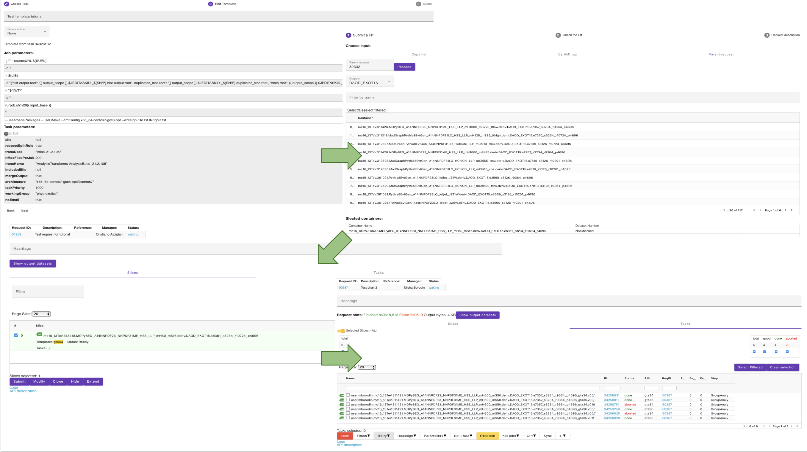

Step-by-step tutorial can be found here <a href="https://atlassoftwaredocs.web.cern.ch/guides/ntuples_production/">Centralised N-tuple Production</a>.

Main steps:

- Submitting a test jobs
- Greate a "gTag"
- Submit the production on how many samples you need

> ## Main steps
>
> - Submitting a test jobs
>
> - Greate a "gTag"
>
> - Submit the production on how many samples you need
{: .callout}

{:width="700"}{: .image-with-shadow }

<!----------------------------------- fin --------------------------------------------->


