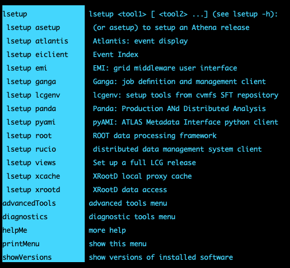

Step-by-step tutorial can be found here <a href="https://atlassoftwaredocs.web.cern.ch/guides/ntuples_production/">Centralised N-tuple Production</a>.

Main steps:

- Submitting a test jobs
- Greate a "gTag"
- Submit the production on how many samples you need

> ## Main steps
>
> - <a href="#atlasenv">Setup the ATLAS environment</a>
>
> - <a href="#certificate">Accessing ATLAS data: your 509 Proxy Certificate</a>
>
> - <a href="#login">Read data from Rucio </a>
{: .callout}

<!------------------------------------------------------------------------------------->
<!------------------------------ atlas environment -------------------------------------->

<h2 id="account"> Set up the ATLAS environment </h2>

Now that you logged into the analysis facility, to load ATLAS environment, add the following lines a shell script `myatlasenv.sh`. 

~~~bash
#!/bin/bash
export ATLAS_LOCAL_ROOT_BASE=/cvmfs/atlas.cern.ch/repo/ATLASLocalRootBase
export ALRB_localConfigDir=$HOME/localConfig
source $ATLAS_LOCAL_ROOT_BASE/user/atlasLocalSetup.sh
~~~
{: .language-bash}
{: .output}

Run the script to set up ATLAS environment and look at the image with the output.
~~~bash
 source myatlasenv.sh
 # at this point, you can lsetup root, rucio, athena, etc.
~~~

{:width="600"}{: .image-with-shadow }

Create a directory for the examples (optional)

<!----------------------------------- fin --------------------------------------------->


